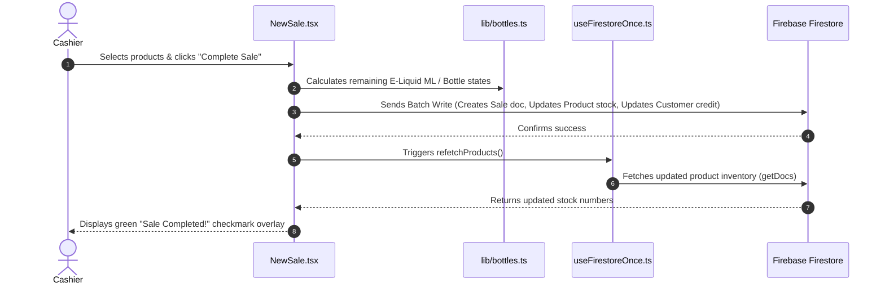

Here is an easy-to-understand breakdown of your application **VapeTrax Web POS**.

Think of this document as your **App Ownership Field Guide**. It will give you a clear map of what technologies you are using, where all the files live, and how data flows through the application when a user clicks a button.

---

# 1. The Technology Stack (The Ingredients)

Your app is a modern **Single Page Application (SPA)**. This means the entire website loads once in the browser, and as users click around, pages switch instantly without reloading the whole web page.

| Technology | What it is | What it does in VapeTrax |
| :--- | :--- | :--- |
| **React** | Frontend UI Framework | Powers the visual interface, pages, components, buttons, and state (screens update automatically when data changes). |
| **TypeScript** (`.ts` / `.tsx`) | JavaScript with Safety Rules | Ensures data types match (e.g., `price` is always a number, not text), preventing common bugs before code runs. |
| **Vite** | Build Tool & Local Server | Compiles your code super fast while developing locally (`npm run dev`). |
| **Tailwind CSS & Lucide Icons** | Styling & UI Icons | Provides modern visual styling (glassmorphism cards, purple accents) and crisp icons (cart, dollar sign, users). |
| **Firebase Firestore** | NoSQL Cloud Database | Stores all your live production data in the cloud (products, sales, customers, expenses, settings). |
| **Firebase Auth** | User Authentication | Handles user login, passwords, session tokens, and security. |
| **GitHub + Vercel** | Code Hosting & Cloud Deployment | GitHub stores your source code. Whenever you `git push` to GitHub, Vercel automatically builds and publishes your website online. |

---

# 2. Project File Map (Where Everything Lives)

If you open the project in VS Code or your AI editor, almost everything you care about lives inside the **`src/`** folder. Here is the blueprint:

```text
VapeTrax-Web-2.0/
├── src/
│   ├── components/      # Small, reusable UI pieces (modals, cards, navigation)
│   │   ├── credits/     # Customer credit history modal
│   │   ├── customers/   # Add/Edit Customer modal
│   │   ├── layout/      # Sidebar, headers, layout wrappers
│   │   └── ui/          # General spinners, buttons, alerts
│   │
│   ├── contexts/        # Global state providers accessible across the whole app
│   │   └── AuthContext.tsx  # Handles WHO is logged in, their role (admin/cashier), and shopId
│   │
│   ├── hooks/           # Custom reusable data helpers
│   │   ├── useFirestoreOnce.ts # Performs 1-time efficient fetches from Firestore
│   │   └── usePWA.ts           # Handles "Install App" browser prompts
│   │
│   ├── lib/             # Pure math, helpers, and business logic
│   │   ├── bottles.ts   # Special logic for E-liquid bottle ML calculations & refilling
│   │   ├── finance.ts   # Profit, revenue, and COGS (Cost of Goods Sold) calculations
│   │   ├── actor.ts     # Tracks who performed an action (Admin vs Cashier name/time)
│   │   └── utils.ts     # Currency formatting (PKR / Rs), class name merges
│   │
│   ├── pages/           # The actual full-screen pages of your web app
│   │   ├── Dashboard.tsx       # Main business overview & metrics
│   │   ├── NewSale.tsx         # The POS Point of Sale checkout screen
│   │   ├── Sales.tsx           # History of past transactions & receipts
│   │   ├── Stock.tsx           # Product inventory management & bottle tracking
│   │   ├── Customers.tsx       # Customer roster & credit balance tracking
│   │   ├── Expenses.tsx        # Shop operating expenses (rent, electricity, salaries)
│   │   ├── PersonalExpenses.tsx# Personal budget isolated from the shop
│   │   ├── Analytics.tsx       # Graphical charts and performance analysis
│   │   ├── DetailedReports.tsx # Printable / exportable reports
│   │   ├── InventoryLogs.tsx   # Audit trail of stock additions/deductions
│   │   └── Settings.tsx        # Shop profile, theme options, cashier account creation
│   │
│   ├── App.tsx          # The master router — defines all page URL routes (/pos, /stock)
│   ├── firebase.ts      # Connects your frontend code to your cloud Firebase project
│   └── main.tsx        # The initial entry point that boots up React in the browser
```

---

# 3. Core Architectural Concepts

### A. Multi-Store Isolation (`shopId`)
Your app supports multiple store locations from **a single database**. 
Every piece of data stored in Firestore (a product, a sale, a customer, an expense) has a field called `shopId`.
* When Store A logs in, `AuthContext` detects `shopId = "store_a"`.
* Every query automatically filters data with `where('shopId', '==', shopId)`.
* This ensures Store A never sees Store B's inventory, sales, or financial records.

### B. User Roles (`admin` vs `cashier`)
* **Admin:** Has full access to delete items, edit product purchase costs, view total shop profit analytics, manage personal budgets, and create cashier accounts in `Settings.tsx`.
* **Cashier:** Restricted to making sales, viewing inventory, and recording expenses. Sensitive actions (like bulk deletes or viewing profit margins) are hidden or password-protected.

### C. NoSQL Document Database (Firestore)
Unlike traditional databases with strict SQL tables and rows, Firestore uses **Collections** (like folders) containing **Documents** (like JSON files):
* `products` collection $\rightarrow$ list of product items.
* `sales` collection $\rightarrow$ list of sales receipts.
* `customers` collection $\rightarrow$ list of client profiles & credit balances.
* `expenses` collection $\rightarrow$ shop bill records.

---

# 4. End-to-End Data Flow (Example: Completing a Sale)

To understand how the app works in action, here is step-by-step what happens when a cashier completes a transaction on **`NewSale.tsx`**:



1. **User Action:** Cashier adds items to cart and presses **Complete Sale**.
2. **Local Validation:** `NewSale.tsx` checks if there is enough stock or full bottles available. If it's an E-liquid refill, `lib/bottles.ts` calculates how many ML to subtract from open/closed bottles.
3. **Atomic Batch Write:** The app packages multiple instructions into a single `writeBatch()` and sends it to Firestore:
   * Create a new document in `sales`.
   * Decrease stock quantity in `products`.
   * Log an audit entry in `inventoryLogs`.
   * Increase credit balance in `customers` (if payment method is credit/split).
4. **Local Cache Refetch:** Once Firebase confirms the batch write succeeded, `NewSale.tsx` triggers `refetchProducts()`.
5. **UI Update:** The updated product stock is rendered on the POS screen, cart clears, and a green success banner appears.

---

# 5. Essential Commands & Best Practices for AI Editing

When you prompt your AI editor to update the project in the future, keep these tips in mind:

1. **Running Locally:**
   * Open Terminal in VS Code: `npm run dev`
   * Opens the app at `http://localhost:5173` so you can test changes locally before pushing.

2. **Checking for Type Errors:**
   * Run `npx tsc --noEmit` in terminal to check if any TypeScript types are broken before pushing code.

3. **Deploying Updates:**
   * Push your changes: `git add .` $\rightarrow$ `git commit -m "your update"` $\rightarrow$ `git push`
   * Vercel will auto-deploy your live website within 60 seconds.

4. **Golden Rule for AI Prompts:**
   * Always remind the AI: *"Use `useFirestoreOnce` for fetching collections to prevent excess Firestore read quota usage."*